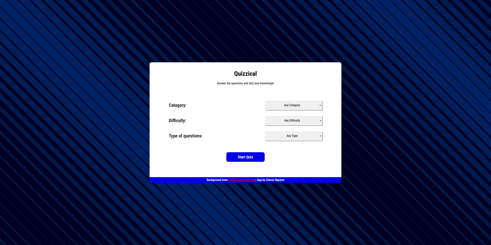
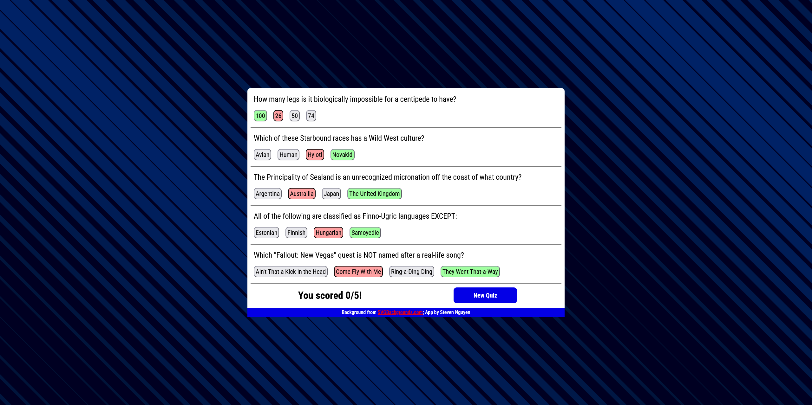

# Quizzical

Try it out online! https://quizzical-ts-steel.vercel.app/

Quizzical is a online trivia game that retrieves its questions from the [Open Trivia Database API](https://opentdb.com/). Players can choose the catagory, difficulty, and type (true/false or multiple choice) of questions.

This WebApp is the final project of Scrimba's [React course](https://scrimba.com/learn-react).

## Built With

- React 19
- Typescript

## Credits

Background SVG image by [SVGBackgrounds.com](https://www.svgbackgrounds.com/set/free-svg-backgrounds-and-patterns/).

## Screenshots:

